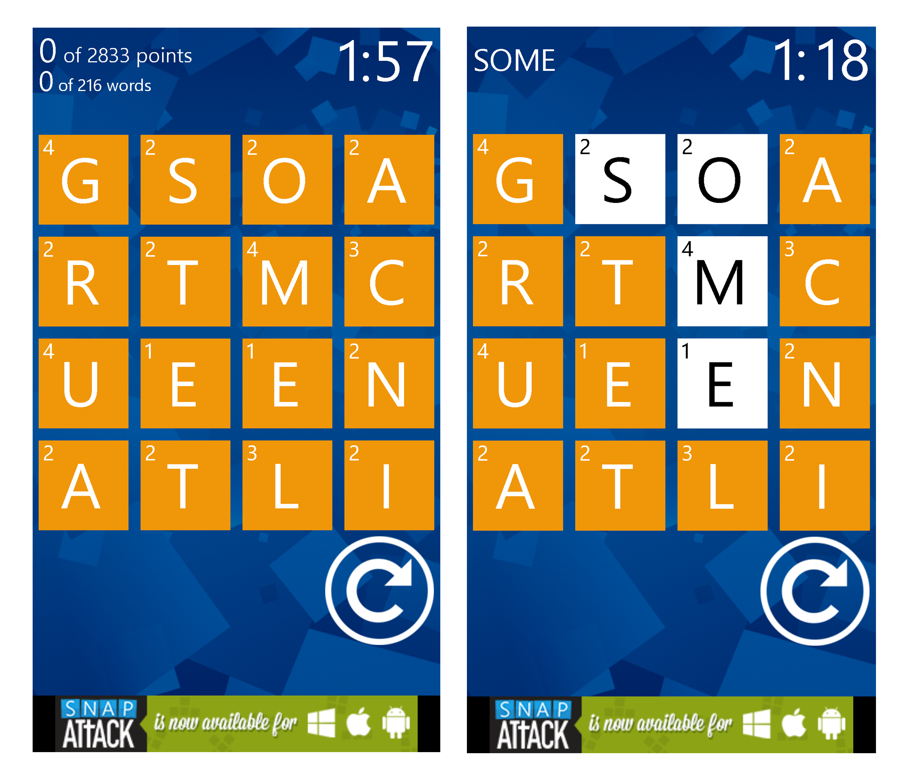

# Wordament-Player

#### Please note this is a project to demonstrate use of an existence trie and depth first graph search to rapidly search a dictionary. Any use of this code or others like it to cheat at Wordament is against the app's policies.

Wordament is a word puzzle game where with the objective of finding words on a 4x4 Tile grid. Neighbouring tiles are selected to form a stirng of characters that in turn create a word. Each tile may only be used once in the formation of a  word. There are no restrictions on directionality when forming a string of characters.

Tiles are any of the four following types.

Letters only: one or more characters that come and any position a word. e.g. [A], [RE]  
Starting Tiles: one or more characters that may only be used at the beginning of a word e.g. [B-],  [TH-]  
Ending Tiles: one or more characters that may only be used at the end of a word e.g. [-P], [-ER]
Either Or Tiles: Two sets of characters separated by a '/' either of which can exclusively be used in a word. e.g.[E/T], [KN/O]

This program works to find all possible words in a wordament matrix. The dictionary of words is stored in an existence trie (trie.py). Such an existence trie enables fast recursive searching during a depth first graph traversal of the matrix as no duplicate searching computation is carried out for words with common prefixes. 

### Instructions
Execute wordamentSolver.py and follow shell instructions.
